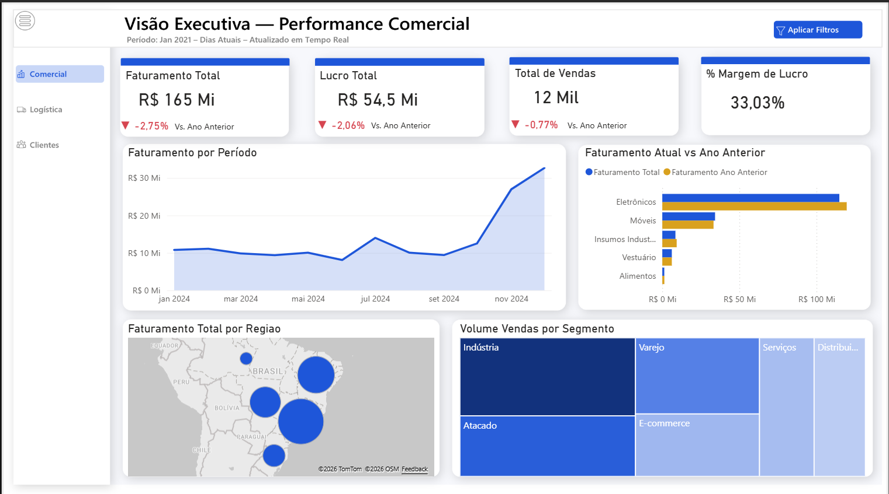
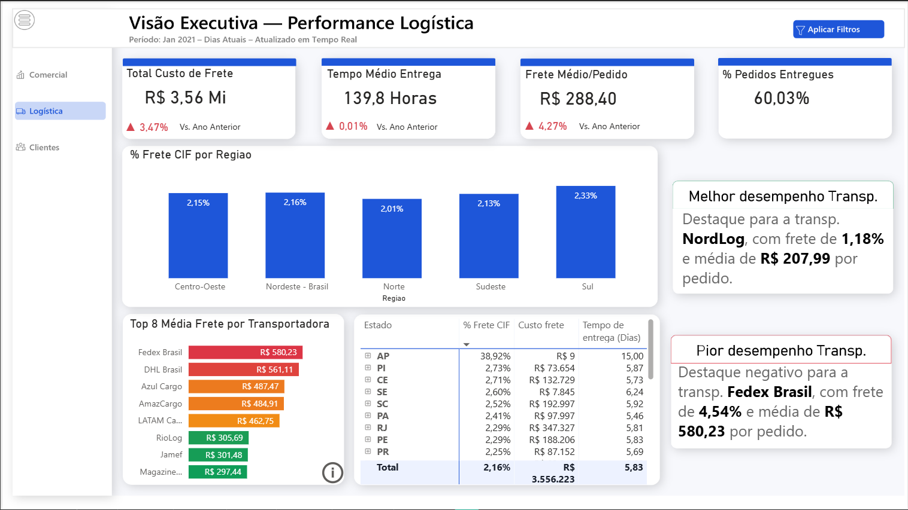
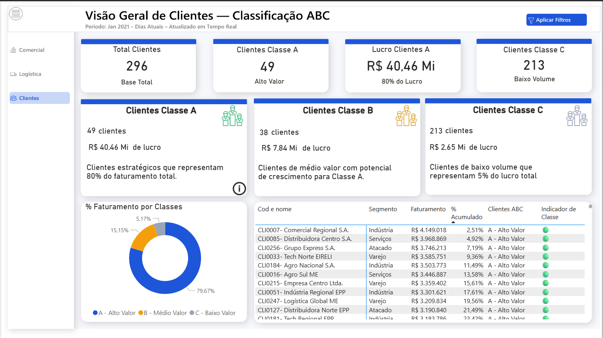

# 📊 Análise Logística & Supply Chain

## Visão Geral
Dashboard desenvolvido em Power BI para análise de performance comercial, logística e classificação ABC de clientes.

## 📸 Screenshots do Projeto

### Visão Executiva — Performance Comercial

**Principais análises:**
- Faturamento Total
- Lucro Total
- Volume de Vendas
- Margem de Lucro
- Evolução temporal do faturamento
- Comparativo Ano Atual vs Ano Anterior
- Distribuição geográfica da receita
- Participação por segmento

---

### Visão Executiva — Performance Logística

**Principais análises:**
- Custo total de frete
- Tempo médio de entrega
- Frete médio por pedido
- Taxa de entregas
- Ranking de transportadoras
- Melhor e pior desempenho logístico
- Análise regional do frete

---

### Visão Geral de Clientes — Classificação ABC

**Principais análises:**
- Curva ABC de clientes
- Concentração de faturamento
- Lucro por classe
- Distribuição da carteira
- Identificação de clientes estratégicos

---

## 🛠️ Tecnologias Utilizadas

- Power BI
- DAX
- Modelagem Dimensional (Star Schema)
- Power Query
- Excel
- Python/Pandas

## 📈 Competências Demonstradas

- Business Intelligence
- Data Visualization
- Storytelling com Dados
- Time Intelligence
- Supply Chain Analytics
- Customer Analytics
- Modelagem de Dados
- Desenvolvimento de KPIs
